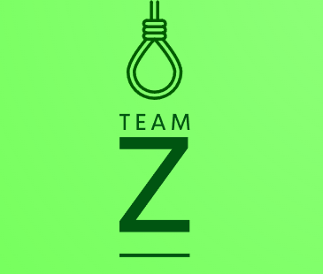

# Sprint-9th-grade-Math-Games
<!DOCTYPE html>
<html>
    <head>
        <link rel="stylesheet" href="style.css">
    </head>
    <body>
        
        <h1>Hangman</h1>
         
        <h4>Try A Retro Game!</h4> 
         
        <h4>Experience The Classics!</h4>
         
        <h2>🖥️About</h2>
        

            Team Z is about remaking retro games so that younger audiences can experience the old classics!  
            Although the team was recently founded, we already have such great relations one to another! 
        
     
         
        <h2>
            How does it work?
        </h2>
        

            After starting up the program, you will be greeted by multiple choices of action.  
            1) "Play"  
            2) "How To Play" 
            3) "Quit" 
        

        <h2>
            👥 Our Team
        </h2>

| Name | Role | Grade |
| :---:   | :---: | :---: |
|  
| <h3><a href = "https://github.com/ADKokalarov23">Asen Kokalarov</a></h3> | Scrum-Trainer | 9G |
  <h3><a href = "https://github.com/BHStoyanov23">Bozhidar Stoyanov</a></h3> |  Front-End Developer  | 9G ||  
| <h3><a href = "https://github.com/DimitarM1234">Dimitar Meshkov</a></h3> | Back-End Developer  | 9G |
| <h3><a href = "https://github.com/GGYankov23">Georgi Yankov</a></h3> | Desginer | 9G |

    </body>
</html>